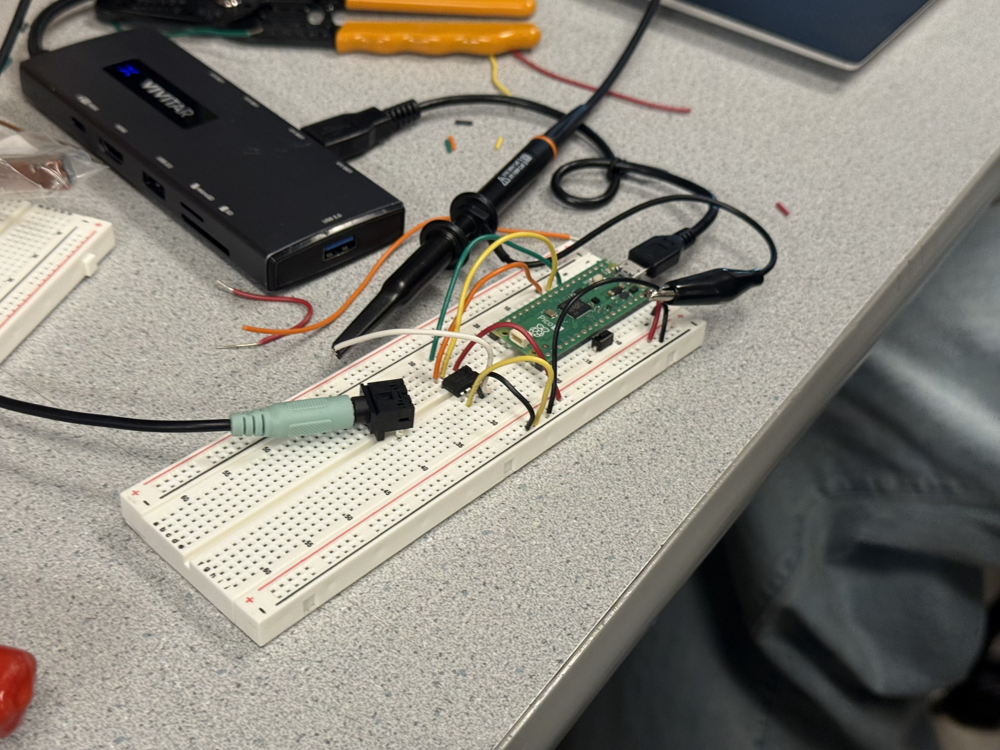
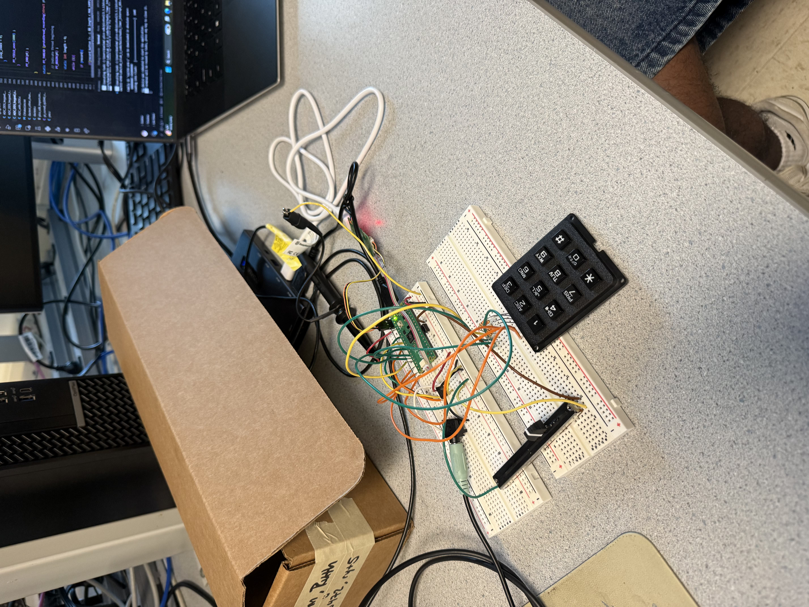
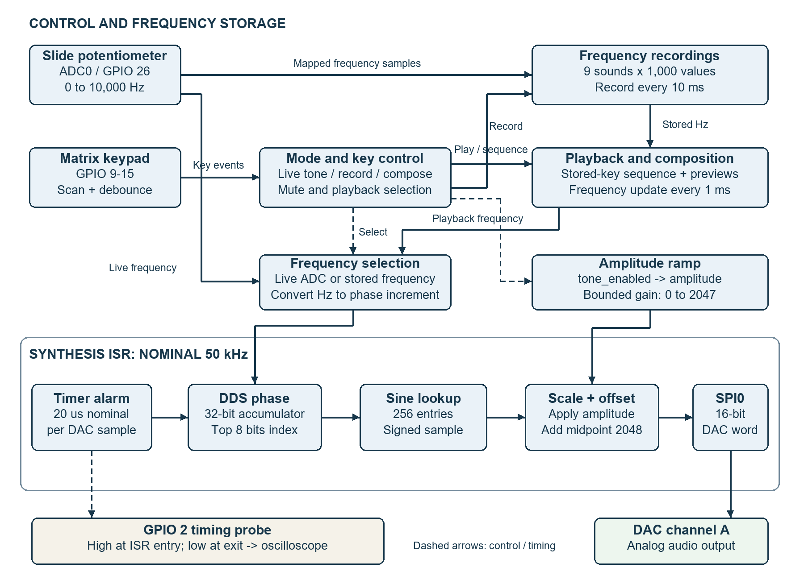
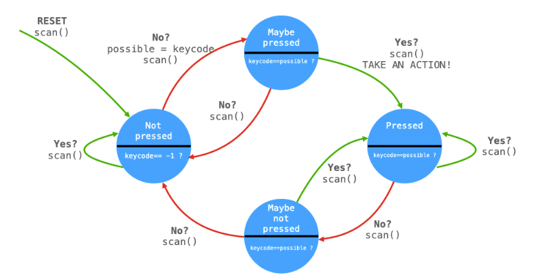
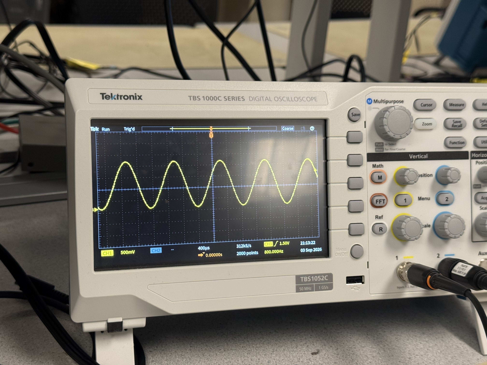
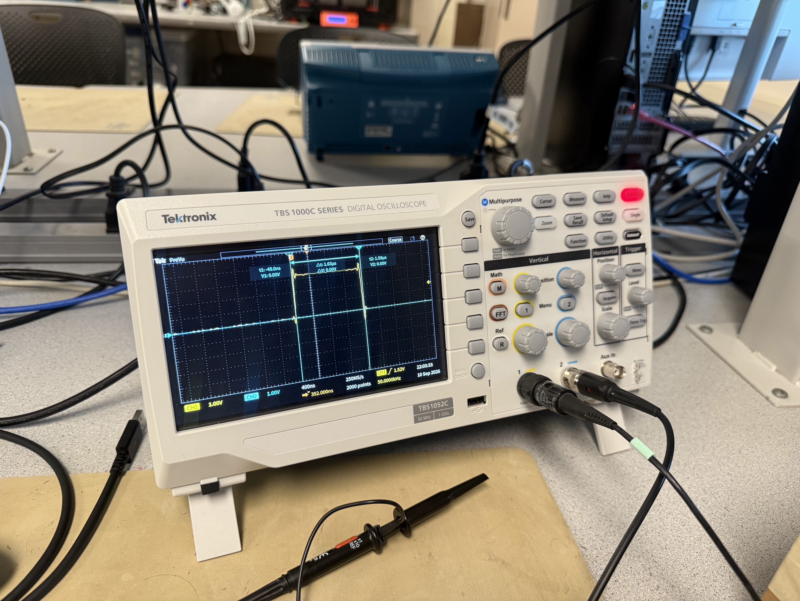

# Programmable Birdsong Synthesizer

ECE 4760: Laboratory 1  
Authors: [GROUP MEMBERS AND NETIDS]  
Laboratory dates: [DATES]  
Source reviewed: September 20, 2026

**Draft status.** This report documents the saved implementation and the milestones the group reports completing. Numerical values identified as nominal or calculated come from source inspection, not laboratory measurements. Replace bracketed fields and insert the required experimental figures before submission. The demonstrated firmware version and physical wiring must be confirmed by the group.

## 1. Introduction

We developed a programmable tone and birdsong synthesizer using a Raspberry Pi Pico 2 build configuration, a slide potentiometer, a matrix keypad, and an SPI digital-to-analog converter. The potentiometer controls a sinusoidal tone over a nominal 0–10 kHz range. The keypad provides muting, storage of nine frequency trajectories, accelerated playback, and entry of a composition whose elements are the stored sounds. A sound can be previewed while entering a composition, making the interface behave like a soundboard.

The project separates audio generation from user interaction. A timer interrupt generates successive waveform samples using direct digital synthesis (DDS), while cooperative protothreads read the controls, record frequencies, manage playback, and change amplitude. Recording the frequency trajectory rather than the audio waveform lets a small memory buffer represent several seconds of sound. Reading that trajectory ten times faster produces rapid frequency modulation without multiplying the carrier frequency.

The assignment is the ECE 4760 version of [Synthesizing Birdsong with the RP2350](https://vanhunteradams.com/Pico/Birds/Birdsong.html). Its checkpoints progress from DAC and ADC integration to recording and accelerated composition. The additional ECE 5730 volume-switch extension is outside this report's scope.

## 2. Design and Testing Methods

### 2.1 Incremental development and milestone mapping

The repository preserves separate programs for successive stages. These are implementation evidence, rather than independent proof of a successful hardware checkout. The group reports meeting the milestones; checkout dates and observations should be added below.

| Checkpoint | Repository evidence | Verification or remaining evidence |
|---|---|---|
| Preparation: build course examples | Pico SDK import and CMake project | Confirm initial successful build and programming procedure |
| Week 1: fixed tone and DAC output | `dactest.c`: 800 Hz DDS command, channel A | Scope waveform and audible output; measured frequency [ ] |
| Week 1: change DAC channel | `dactest_other_channel.c`: channel B control word | Probe B and confirm output moved; observation [ ] |
| Week 1: external boot button | Build links `pico_bootsel_via_double_reset` | This library does not prove the external button was wired; add circuit/photo and checkout result |
| Week 1: potentiometer and ADC | `ADC_with_DDS.c`: ADC channel 0 mapped to 0–10,000 Hz | Endpoint/intermediate ADC and frequency measurements [ ] |
| Week 2: keypad integration and mute | `ADC_DDS_keypad_mute.c`: four-state debounce and amplitude ramp | Repeated press/hold/release test; result [ ] |
| Week 2: nine recordings and normal-speed playback | `ADC_DDS_keypad_record.c`: frequency buffers and 10 ms playback | Distinct recordings, replacement, hold/release behavior; result [ ] |
| Week 2: interrupt timing | GPIO 2 surrounds synthesis ISR | High-pulse width and period [ ] |
| Week 3: live tone at boot and return via 0 | `ADC_DDS_keypad_speedup.c`: initial tone enabled; mode cancellation on 0 | Startup and mode-transition tests [ ] |
| Week 3: accelerated playback | Final file: 10 ms record, 1 ms playback | Nominal 10:1; measured duration ratio [ ] |
| Week 3: composition and sound previews | Final file: nine-entry sequence; indirect lookup of stored sound | Nonconsecutive/repeated-key sequence and interrupted-preview test [ ] |
| Week 3: demonstration without restart | Final state transitions support repeated operation | Group/TA observation, cardinal imitation, and Merlin result [ ] |

Historical programs explain development; only `ADC_DDS_keypad_speedup.c` is selected by the current CMake target. No claim is made that every historical file represents the exact version demonstrated.

### 2.2 Hardware approach

The source configures SPI0 for 16-bit transfers at a requested 20 MHz, with clock polarity and phase both zero. The final program sends the channel-A configuration word followed by a 12-bit DAC code in the same 16-bit frame. The assignment specifies an MCP4822 DAC; the actual installed component should be confirmed against the breadboard. The command uses unity gain and enables the selected channel.

The slide potentiometer wiper connects to GPIO 26, which is ADC input 0. Its endpoints should connect to the analog supply range and ground so that the wiper remains within the ADC input range. Four keypad rows use GPIO 9–12, and three columns use GPIO 13–15 with internal pull-ups. Each scan drives one row low, waits 1 microsecond, and reads the columns. The code compares the resulting pattern against a lookup table to identify digits, asterisk, and hash.

The functional block diagram and pin-assignment table give a logical interconnect derived from the program. They are not a substitute for the as-built schematic: DAC latch wiring, supply bypassing, external boot circuitry, audio-jack connections, and any coupling components must be added from the actual setup.

The hardware photographs document two stages of assembly. The initial setup shows the controller, DAC circuit, audio socket, and oscilloscope probing. The later setup includes the slide potentiometer and telephone-style keypad. The photographs establish the physical arrangement but do not resolve every electrical connection.

### 2.3 DDS and amplitude control

For ADC code a, the requested frequency is calculated using integer arithmetic:

`f_command = floor(a × 10000 / 4095)` Hz.

The requested phase increment is:

`Δ = floor(f_command × 2^32 / 50000)`.

At each interrupt, the unsigned 32-bit phase accumulator is advanced by Δ. Overflow naturally wraps the phase. The upper eight bits select one of 256 entries in a sine table initialized with `2047 × sin(2πi/256)`; the source uses 6.283 as its approximation to 2π. A signed sample is scaled by the amplitude variable before adding a midpoint offset:

`DAC_code = 2048 + trunc(sine_table[phase >> 24] × amplitude / 2047)`.

The normal bounds are 1–4095 at full amplitude, with silence represented by a constant midpoint code of 2048. Muting therefore removes the AC waveform; it does not drive the DAC output to zero volts. The phase accumulator keeps advancing while muted.

Amplitude is clamped between 0 and 2047. The final amplitude thread changes it by 103 and yields for 50 microseconds. A full transition needs 20 updates, giving an approximate 1 ms ramp timescale before scheduling delays. The comment describing 1 ms updates is stale; the earlier mute version did use that slower interval. This envelope applies to playback start/stop transitions, not automatically to every individual element inside a composition.

### 2.4 Recording, playback, and concurrency

Five protothreads run on the default core scheduler. Although multicore, DMA, and PIO headers are included, the final application does not launch a second core or use DMA/PIO for synthesis.

| Routine | Role | Requested yield |
|---|---|---|
| `protothread_toggle25` | Read ADC, print commanded frequency, update live-tone increment when playback is inactive | 10 ms |
| `protothread_core_0` | Scan keypad, debounce, dispatch mode actions | 30 ms |
| `protothread_amplitude` | Move amplitude toward its enabled/muted target | 50 µs |
| `protothread_playback` | Select successive frequencies from an individual sound or composition | 1 ms |
| `protothread_recording` | Append frequency values while recording | 10 ms |
| `alarm_irq` | Advance DDS and transfer DAC sample | Nominal 20 µs alarm interval |

Recordings use `uint16_t sounds[9][1000]` and one valid length per sound. Key k maps to row k−1. The sample storage occupies 18,000 bytes and represents nominally ten seconds per key. At 100 Hz, each entry describes the frequency over roughly 10 ms. Playback updates the phase increment every 1 ms, compressing the trajectory to approximately one-tenth its recorded duration. The DAC sample rate remains unchanged, and the stored frequencies are not multiplied by ten.

The recording thread resets its local write index while idle and updates the selected row's length after each write. When the array is full, additional samples are discarded until release. Recordings reside in RAM and are lost on reset or loss of power. A composition stores nine key numbers rather than copying the sound data; consequently, re-recording a key changes the sound referenced by any retained composition.

The live ADC thread yields ownership of `phase_incr_main` whenever either playback flag is set. Mode entry cancels competing playback and resets the sequence and sample positions. Key 0 cancels recording/composition/playback and restores the current potentiometer frequency; if no other mode is active, it toggles the live tone. During compose entry, digit presses both append a key number and preview a nonempty sound. The second hash cancels the preview and begins sequence playback from the first entry.

### 2.5 Testing methods and acceptance evidence

The following is the verification procedure for this implementation. The supplied photographs document a sinusoidal output and a timing pulse. Other procedures below remain proposed verification tests unless accompanied by the group's recorded results.

1. **DAC and tone calibration.** Run the fixed-tone test on A, then the channel-B variant. Measure frequency, DC midpoint, peak-to-peak amplitude, and waveform shape. In the ADC program, record ADC code and measured frequency at both endpoints and several intermediate positions. At the zero-frequency endpoint, expect a stationary DAC code rather than a periodic waveform.
2. **Debounce and mode entry.** Hold 0 through several scans and verify exactly one action. Repeat with deliberately slow releases and with asterisk/hash. Observe whether the action occurs on press or release. Verify that the current program acts on confirmed press even though comments describe release.
3. **Recording isolation.** Store distinguishable sweeps on keys 1, 5, and 9; replay each; overwrite key 5 with a shorter trajectory; confirm the others are unchanged and no old tail remains. Test a long hold at the capacity limit and a very short hold.
4. **Speed measurement.** Record a trajectory containing identifiable frequency transitions. Measure its recording interval and the corresponding playback interval, then calculate `S = T_record / T_play`. Repeat to estimate variation; compare S with the requested 8–10 range. Keep serial-output conditions the same as during the demonstration.
5. **Composition.** Enter a nonconsecutive sequence such as 9, 1, 9, 5. Verify each preview and the final ordering. Start sequence playback while a preview is still active. Interrupt the sequence with a soundboard key, then test return via 0 and entry via asterisk/hash without resetting the board. Test empty slots, an empty composition, and a tenth sequence entry.
6. **Audio quality and timing.** Capture a complete programmed sweep with its amplitude envelope. Measure rise, sustain, and fall times and inspect any discontinuity at sequence boundaries. Probe GPIO 2 for ISR high time and repetition period under normal and heavy keypad/serial activity. Capture audio for a spectrogram and compare the frequency trajectory with the intended birdcall.

For each frequency point, report signed error `f_measured − f_command` and percentage error for nonzero commands. Report instrument resolution or cursor uncertainty. For speed ratio uncertainty, independent duration uncertainties can be propagated as `σS/S ≈ sqrt((σTr/Tr)^2 + (σTp/Tp)^2)`. Do not assign an error bar solely from software resolution.

### 2.6 Use of AI

We used an AI coding assistant through an iterative dialogue to explain DDS amplitude and frequency control, inspect the debounce state machine, compare code with the lab behavior, and suggest implementations for recording and composition. The conversation records advice about missing switch breaks, array bounds and lengths, frequency-versus-phase-increment storage, playback timing, ADC ownership during playback, sequence indexing, and mode reset behavior. The group repeatedly requested reviews without file changes and made subsequent revisions themselves.

One visible assistant edit changed an earlier keypad source to shorten the fade, relocate its toggle to a release transition, register the keypad/amplitude threads, and remove an undefined LED reference. Later revisions do not retain every suggestion: the final source still dispatches control actions on confirmed press. Code visible in the final file supports adoption of several other suggestions, including fixed-size frequency buffers, bounded amplitude updates, sequence indirection, and the key-0 return-to-tone behavior.

AI output was treated as a proposal to inspect, not experimental evidence. No scope timings, spectral measurements, successful identification results, or acceptance statistics were invented. Appendix B records the available provenance and the limitations of reconstructing a complete prompt log. The group must verify this disclosure and supply the full exported dialogue for the required audit.

## 3. Documentation

### 3.1 Logical wiring and signal flow

| Pico signal | Program assignment | External connection / confirmation |
|---|---|---|
| GPIO 5 | SPI0 chip select | DAC active-low CS |
| GPIO 6 | SPI0 clock | DAC SCK |
| GPIO 7 | SPI0 transmit | DAC SDI |
| GPIO 4 | SPI0 receive function configured | No DAC read transaction is used |
| GPIO 26 | ADC0 | Potentiometer wiper |
| GPIO 9–12 | Row outputs | Keypad rows; confirm connector order |
| GPIO 13–15 | Pulled-up column inputs | Keypad columns; confirm connector order |
| GPIO 2 | ISR timing output | Scope probe |
| GPIO 25 | LED toggle output | Code assignment; board-specific LED behavior is not verification of audio |
| Supply and ground | Not established by C source | Add actual DAC, potentiometer, and shared-ground wiring |
| DAC latch, audio socket, boot button | Not established by C source | Add actual connections and any component values |

Because the keypad thread yields between scans and every switch case ends with a break, a single observation cannot pass through all debounce states. The remembered key identifies the recording to stop after the raw input no longer names that key. A different valid key is treated as loss of the previous key; this is a single-key interface, not a general multi-key rollover implementation.

### 3.2 Reproduction and program listings

The current build selects `ADC_DDS_keypad_speedup.c` in target `Audio_Timer_Interrupt_DDS`, with `PICO_BOARD` set to `pico2`. The CMake configuration names SDK 2.3.0 and toolchain 15_2_Rel1 and includes the local `pt_cornell_rp2040_v1_4.h`. Reproduction requires the SDK import file, the matching SDK/toolchain setup, the protothreads header, and the selected application source. Configure and build using the Pico extension or the existing CMake workflow, then program the generated UF2 using the board's bootloader procedure. Confirm the actual board and tool versions used during checkout.

Appendix A is a complete, source-preserving listing of all six C files and CMake configuration, with explanatory annotations added only to the documentation. It includes an inventory and hashes so later code changes can be distinguished from this report's snapshot. The application files were not edited to prepare this report.

## 4. Results

### 4.1 Source-derived performance

| Quantity | Calculated or configured value | Interpretation |
|---|---|---|
| Audio sample rate | 50,000 samples/s nominal | Set by 20 µs alarm delay; actual period needs measurement |
| Frequency command range | 0–10,000 Hz | Integer mapping from ADC code |
| Mean frequency-command spacing | 10,000/4095 ≈ 2.442 Hz per ADC code | Actual adjacent integer commands differ by 2 or 3 Hz |
| DDS increment resolution | 50,000/2^32 ≈ 0.00001164 Hz | Ideal digital tuning granularity, not measured accuracy |
| Sine table | 256 entries | Phase index resolution 1.40625° |
| Record interval | 10 ms nominal | Approximately 100 frequency entries/s |
| Playback interval | 1 ms nominal | Approximately 10× trajectory speed |
| Per-key recording limit | 1,000 entries | Approximately 10 s recorded / 1 s accelerated |
| Frequency storage | 18,000 bytes | Nine arrays of 1,000 unsigned 16-bit values |
| Composition capacity | Nine entries | Repetitions allowed; no entry timestamps stored |
| Fade timescale | Approximately 1 ms | 20 updates with 50 µs yields; timing varies |
| SPI frame wire time | 16 / 20 MHz = 0.8 µs nominal | Excludes software and interrupt overhead |

The interrupt rearms the alarm relative to the timer value read inside the ISR. Interrupt-entry and pre-rearm latency therefore contribute to the effective sample period. DDS uses the nominal 50 kHz constant, so any measured sample-rate error proportionally changes the generated frequency. Similarly, thread yields specify waiting intervals, not guaranteed sampling deadlines. The enabled frequency printout can add scheduling delay. These effects prevent claiming exact 10× speed or exact pitch from source alone.

### 4.2 Experimental observations and remaining measurements

| Measurement | Observed value | Uncertainty / evidence |
|---|---|---|
| Fixed-tone waveform | Scope displays 800.000 Hz | IMG_7767; DAC output channel and instrument uncertainty not documented |
| Potentiometer minimum/maximum frequency | [MEASURE] | [ADC codes and scope resolution] |
| Largest frequency error over tested points | [MEASURE] | [Number/range of points] |
| Timing-pulse high interval | Cursor separation 1.63 µs | IMG_7909; one capture, not a worst-case timing bound |
| Timing-trace repetition | Scope displays 50.0000 kHz, corresponding to 20.0 µs | IMG_7909; period inferred from displayed frequency |
| Record/playback duration ratio | [MEASURE] | [Repeated trials and variation] |
| Envelope rise / sustain / fall | [MEASURE] | [Scope figure] |
| Debounce reliability and mode cycling | [OBSERVATION] | [Test count and failures] |
| Cardinal imitation / Merlin outcome | [OBSERVATION] | [Spectrogram and demo notes] |

The fixed-tone photograph shows a sinusoidal waveform with an 800.000 Hz frequency readout. The displayed scales are 500 mV/division and 400 µs/division. This is consistent with the 800 Hz baseline program. The photo does not establish which DAC output was probed, and the readout precision is not an uncertainty estimate or proof of zero frequency error.

The timing photograph shows a high pulse bounded by cursors at approximately -48.0 ns and 1.58 µs; the instrument reports a 1.63 µs separation. The displayed frequency is 50.0000 kHz. Interpreting this as the GPIO 2 ISR instrumentation gives an instrumented-body occupancy of approximately 1.63/20.0 = 8.15%. This interpretation is consistent with the timing code, but the photograph alone does not identify the probe connection or firmware version. The observation is a single captured interval, not a measured maximum across operating conditions. Interrupt overhead outside the GPIO writes is excluded.

**Required envelope evidence:** [INSERT OSCILLOSCOPE CAPTURE of a complete generated sweep/chirp, labeling rise, sustain, fall, voltage scale, and time scale. The fixed-tone trace above does not show this envelope.]

**Required spectrogram:** [INSERT SPECTROGRAM of this device's audio, with time/frequency axes, recording method, and analysis settings.]

### 4.3 Limitations visible in the submitted snapshot

Control actions are dispatched on confirmed press, despite the source comment and the requested press/release phrasing. Recording starts in the next held-key scan, introducing an extra scan interval after press confirmation, and stops after release confirmation. Short holds may not create new samples. The preserved write-length scheme does not explicitly clear the old slot length at the start of a new recording; a replacement that captures no samples can leave the previous sound intact.

The composition playback routine spends a separate iteration advancing between entries. During that roughly 1 ms interval, the DDS retains the previous frequency. Empty entries also consume an iteration, and an all-empty composition can briefly enable output at a stale frequency. The sequence-entry path accepts empty keys even though individual playback rejects them. A composition stores order only; pauses between the user's key presses are not recorded. Silence must be represented deliberately rather than inferred from entry timing.

Amplitude remains enabled between composition elements, so there is no independent attack/release envelope on each stored element. At the end of playback, clearing the playback flag lets the ADC thread regain frequency control before the fade necessarily finishes. These are identifiable limitations to compare with the scope and spectrogram, not measured claims that audible artifacts occurred.

## 5. Conclusions

The saved implementation provides a compact architecture for a programmable birdsong instrument: a timer-driven DDS engine, low-rate frequency storage, accelerated replay, and a keypad composition interface. Separate source versions make the progression from basic DAC output to interactive synthesis reproducible. Previewing sounds during composition and using key 0 to return to the potentiometer reduce the need to reset or reprogram the board during use.

The principal engineering tradeoff is between simplicity and timing precision. Cooperative threads simplify control logic, but their requested intervals do not guarantee exact playback speed. Finite arrays avoid allocation complexity while limiting both sound duration and composition length. Boolean mode flags are workable when consistently reset, but an explicit mode enumeration and centralized transition functions would make future changes easier to verify.

Further improvements would include deadline-based frequency updates, suppression or throttling of diagnostic prints during timing measurements, explicit handling of empty/full buffers, and defined transitions between successive sound envelopes. The supplied photographs support baseline sinusoidal output and a short timing-pulse interval. A completed evaluation still requires the envelope capture, spectrogram, additional timing trials, and demonstration results; the available evidence does not establish full checkpoint compliance.

## 6. Lab-Specific Deliverables and Questions

The current lab page does not give a separate numbered theory-question list. Its report-specific deliverables are the envelope scope capture, a generated-audio spectrogram, a commented program listing, and an AI prompt log with exchange and change counts. The results section includes the fixed-tone and timing photographs and identifies the envelope and spectrogram evidence still needed; Appendix A supplies the annotated listing; Appendix B supplies a partial AI provenance record and identifies the missing full export. [Lab report instructions](https://vanhunteradams.com/Pico/Birds/Birdsong.html).

For the timing question, compute interrupt occupancy from measured values as `100 × ISR_high_time / measured_period`. Report that the GPIO pulse omits overhead outside the instrumentation. For the acceleration question, use the measured duration ratio rather than multiplying the DDS phase increment. For the storage question, 100 Hz frequency storage is sufficient for the deliberately slow input trajectory and uses 1/500 the samples of 50 kHz waveform storage at equal sample width.

The example reports informed organization only: an explanation of design choices, diagrams linked to software, explicit testing methods, measured results, and a code appendix. Their hardware, experiments, measurements, and conclusions were not reused as this group's results. References: [Birdsong](https://vanhunteradams.com/Pico/CourseMaterials/Birdsong.pdf), [Birdsong2](https://vanhunteradams.com/Pico/CourseMaterials/Birdsong2.pdf), [Cricket](https://vanhunteradams.com/Pico/CourseMaterials/cricket.pdf), and [Reaction](https://vanhunteradams.com/Pico/CourseMaterials/reaction.pdf).

## Submission Completion Checklist

- Insert group names, dates, actual board identification, and demonstrated source version.
- Add the as-built schematic, including latch, power, boot button, and audio connections.
- Replace experimental placeholders with recorded results, not nominal values.
- Add the waveform/envelope figure and spectrogram; confirm the probe connection and firmware used for the supplied timing trace.
- Confirm checkpoint/demo outcomes and any Merlin identification result.
- Export the complete AI conversation, reconcile suggested/accepted change counts, and attach it with Appendix B.
- Reconcile the documented implementation limitations with the version actually demonstrated.
